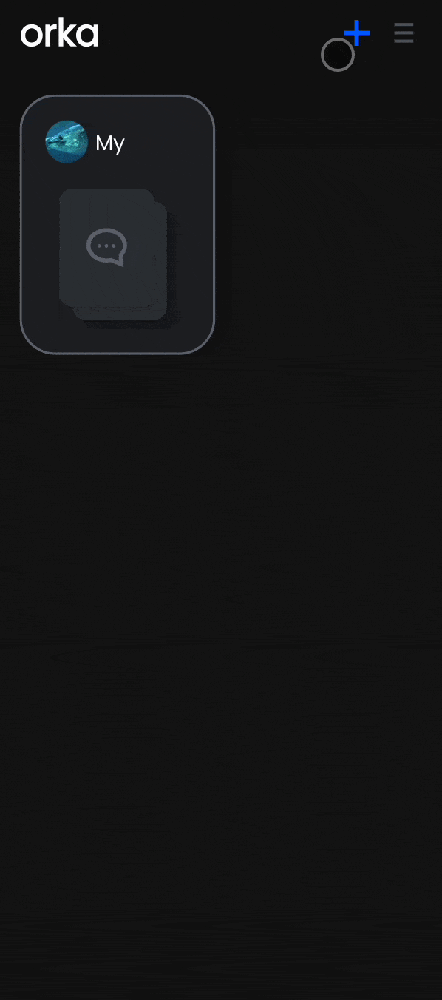

# 🐬🐬 Orka!
[`Orka`](https://orka.run) is peer to peer LAN(Local Area Network) data sharing service. It's a renewal version of [`LocalDrop`](https://github.com/24seconds/localdrop).

## Orka links
- main: https://orka.run/
- dev version: https://dev.orka.run/


## [Table of Contents](#table-of-Contents)
- [Demo](#demo)
- [💡 Motivation](#motivation)
- [📚 How to use](#how-to-use)
  - [Sending data](#sending-data)
  - [Check system message](#check-system-message)
  - [Change color theme](#change-color-theme)
  - [Self Hosting](#self-hosting)
- [🚧 RoadMap](#roadmap)
- [💻 Compatibility](#compatibility)
- [🤖 Self QnA](#self-qna)


## Demo

link : https://orka.run


### Mobile version



-----------------------

## Motivation

💡 In home and office, sometimes I need to transfer data (text or file) from device1 to device2. It would be easy if sharing app (google drive, dropbox, etc) is installed in both devices. But most of time, it is not. So I decided to make my own sharing service. The reason to make this by myself is because it would be fun and I can customize whatever I want. Plus, I haven't used webRTC and webSocket before, it's good chance to practice those apis! That's why I made `Orka`.

Previously, it was [`LocalDrop`](https://github.com/24seconds/localdrop) but due to poor design, I renewaled with talented designer - [Check behance](https://www.behance.net/goodman089e31)!


-------

## How to use 

📚 Each browser has its own name. It's all sea creatures. The browser's own name is `My`. When other peers upload file or text, then peer tab will be updated. Click the peer then peer's shared files or texts are displayed.
You can download a file or copy a text or url.

**Important!**: To use download feature, Turn off `Update on reload` in chrome devTools - Application - Service Workers section. To avoid memory issue for large file transfer, Orka uses [StreamSaver.js](https://github.com/jimmywarting/StreamSaver.js). It ingeniously solves memory issue using iframe + service worker. Because it utilizes service worker heavily, we need to turn `Update on reload` option off.

### Sending data


You can send text or any kind of data.  
📁📋 To send any kind of data, click the `Upload` button.  

**Important!**: After you upload files, it does not transfer to others immediately. It just gives `download link` to other peer. When other peer requests download, then transfer starts.


### Change color theme


🎨 Okra supports `Light` and `Dark` mode!  


### Self Hosting

🛠️ Because webRTC needs to transfer offer and answer between peers, there is signaling server outside of LAN. If you want to host signaling server by yourself. Follow these steps.

- clone this repository

#### client side

```
// in the repository,
$ cd client
$ yarn dev
```

#### signal server side
```
// in the repository,
$ cd signaling-server
$ npm run dev
```

#### Change url as you want!
Many urls are from `.env.development` file. Customize yourself

```
// File: .env.development

REACT_APP_NODE_ENV=development  
REACT_APP_PUBLIC_URL=http://localhost:3000  
REACT_APP_MITM_URL=http://localhost:8080  
REACT_APP_WEB_SOCKET_URL=ws://localhost:4000  
REACT_APP_VERSION_NUMBER=v0.1.0  
BROWSER=none  
```

### Verify downloaded file
This is for checking download function works as expected. There is a file for this `verify_file.js`. You can use it as below.
```sh
$ node verify/verify_file.js {your-file1} {your-file2}
```

-------

### RoadMap

🚧  Current version is v1.0.0. There are lots of things to do. Here's TODO list

- [ ] Remove chunk header (It causes slow down download speed)
- [ ] Create dataChannel everytime download request (to support parallel download)
- [ ] Better UX - animation
- [ ] Notify system message via toast or notification
  - notification center would be nice?
- [ ] Display download progress for transfer side
- [ ] Handle peerConnection recreate
- [ ] Handle webSocket recreate
- [ ] Make docker image to support cross flatform self hosting
- [ ] Make Logo icons
- [ ] Handle ping/pong based on visibility change

------

### Compatibility

🌐 Because I use chromium, chrome and samsung browser, I tested those and it seems Orka runs smoothly.

------

### Self QnA

🙋 This section is self QnA.  

#### Why Browser Compatibility is limited?

Because I made this to use by myself, I haven't tested on Opera and Firefox.  
One thing for sure is that Orka can not support ios Safari and Safari.

#### Okra not works in my environment X(

Sadly, there are several reasons I guess. In my case, I have experienced this situation in StarBucks. I guess if router blocks sending data to local peer, this could be happened. 


#### 🚄 About download speed

##### Why Okra sends chunk with header?

Currently, Okra sends chunk with `header` to classify where does chunk from. Putting and parsing header has some overhead. If header is removed, then speed would be faster 2 times (I've tested).


##### Why do we care about BufferControl?

Depends on your device (pc or mobile) and network environment, buffer control is needed. In chromium, buffer size is 16 Mb for now, 14:07 Wed 01 Jul 2020. (https://chromium.googlesource.com/external/webrtc/+/master/pc/data_channel.cc#384) If buffer is overflowed in sending side, dataChannel got error `Unable to queue data for sending`.

So I set buffer limit as half of chromium limitation (8 Mb). Hence, because of buffer control, download speed varies a bit.


#### 🍕 Why DataChannel Chunk size is 16k?

`RTCDataChannel.send()` has some limitation. Some people recommends to send around 16kiB at most. I referred these links
- [Understanding message size limits](https://developer.mozilla.org/en-US/docs/Web/API/WebRTC_API/Using_data_channels#Understanding_message_size_limits)
- [WebRTC data channel: Optimum message size (#5)](http://viblast.com/blog/2015/2/5/webrtc-data-channel-message-size)


### 🐏 Memory Issue about Transfer Large file: Why does Orka use StreamSaver.js? 

When transferring large file, we need to care about memory in receiver side. If we just accumulate chunks in memory, device would be crashed easily. I've tested and if you have enough swap space, then accumulated chunks are goes into swap area. It's okay for desktop, but not for mobile.  

We can use filesystem API but it is deprecated. That's why I use [StreamSaver.js](https://github.com/jimmywarting/StreamSaver.js) to avoid memory issue.


## Storybook
WIP
chromatic link: https://62f6fd20d763d291eef988e3-jwgzvlpocx.chromatic.com/
