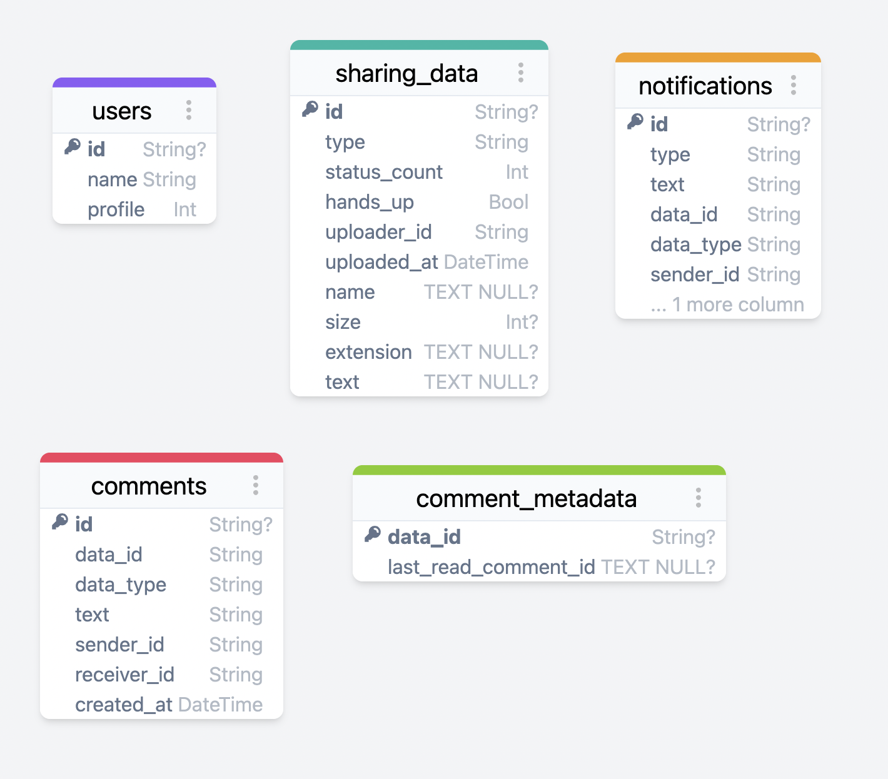

## Db schema <!-- omit in toc -->

Date: 2023-04-16
Author: 24seconds

Table of contents

## Introduction
It would be nice to manage up to date database schema here. Currently it is managed in here (https://github.com/24seconds/orka/pull/30) and it's quite hard to find.

Therefore, from now on the schema will be managed here.

## Schema
Updated: 2023-04-16

## Change logs
- [2023-04-16] upload db schema